# Abhinav Kumar

<kbd>BUILD</kbd> <kbd>BREAK</kbd> <kbd>DEBUG</kbd> <kbd>SHIP</kbd>

---

### `$ whoami`

Security/backend engineer who builds crypto and security tooling **from scratch** —
then ships it as products people can actually use.

<kbd>AES-256-GCM</kbd> <kbd>PBKDF2-SHA256 · 600k iters</kbd> <kbd>Shor's algorithm</kbd> <kbd>IBM quantum hardware</kbd>

- Runs [**crackrsa.com**](https://crackrsa.com) — a live demonstration of quantum computing breaking RSA, powered by a real IBM quantum machine.
- Built [**Haven**](https://taskhavens.com) — an end-to-end-encrypted task app that is genuinely private by default.
- Real-world team experience from an iSoft internship.

### `$ ls ~/projects`

| project | what it is |
|---|---|
| [**Haven**](https://taskhavens.com) | Local-first task app with genuine privacy: every task is **AES-256-GCM** encrypted client-side (key derived via PBKDF2-SHA256, 600k iterations) before it ever touches the network. No account. Works offline. |
| [**crackrsa.com**](https://crackrsa.com) | RSA built from scratch — classical factoring attacks, a real quantum simulator, and a **live IBM quantum hardware run** showing why (and when) quantum computing breaks RSA. |
| [**Ledger Lite**](https://github.com/iabhi92/ledger-lite) | Minimal double-entry bookkeeping for a small business: chart of accounts, invoices, expenses, and full financial reports. A free/cheap SAP alternative — Flask + SQLite. |
| [**iabhi92.online**](https://iabhi92.online) | Security portfolio — the work above, written up in full. |

### `$ cat stack.txt`

### `$ ./gh-stats`

### `$ ./snake`

<picture>
  <source media="(prefers-color-scheme: dark)" srcset="snake-dark.svg">
  
</picture>

### `$ connect`

---

`// keep shipping.`

